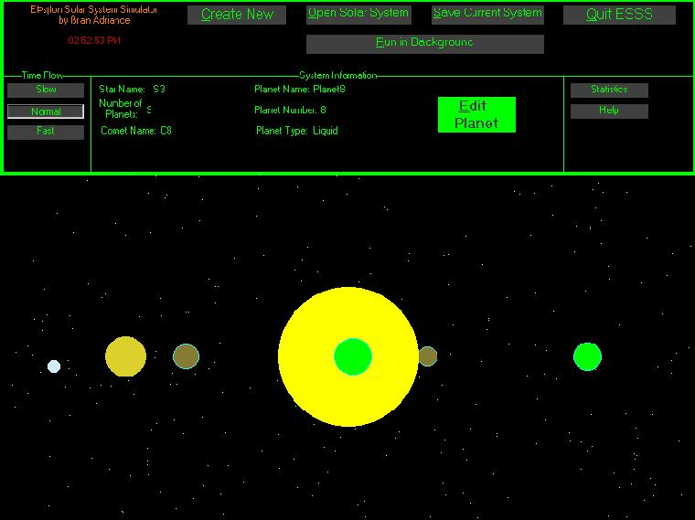



## Solar System Simulator

### Description

This program simulates a solar sytem pretty accuratly. You can create your own solar system, choose the number of planets, star color and size, then you can choose the individuual planet properties. Also you can view your statistics to see how your solar system is rated. Finnally you can save and open solar systems.
 
### More Info
 

             |
---                |---
**Submitted On**   |2003-02-20 14:42:54
**By**             |[Brian\_A ](https://github.com/Planet-Source-Code/PSCIndex/blob/master/ByAuthor/brian-a.md)
**Level**          |Intermediate
**User Rating**    |4.1 (29 globes from 7 users)
**Compatibility**  |VB 6\.0
**Category**       |[Games](https://github.com/Planet-Source-Code/PSCIndex/blob/master/ByCategory/games__1-38.md)
**World**          |[Visual Basic](https://github.com/Planet-Source-Code/PSCIndex/blob/master/ByWorld/visual-basic.md)
**Archive File**   |[Solar\_Syst1547532202003\.zip](https://github.com/Planet-Source-Code/brian-a-solar-system-simulator__1-43382/archive/master.zip)

